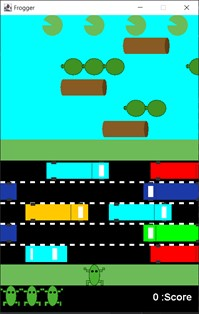
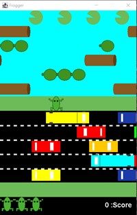
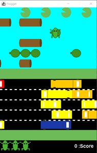
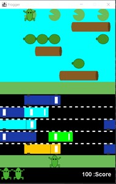
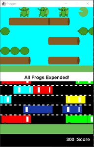

# 1.1 Frogger Game Clone Overview

**Overview written by Peter Mitchell.**

## Contents

```
1.1 Frogger Game Clone Overview 
1.2 Introduction
1.3 The Rules of Frogger 
1.4 High Level Discussion About Implementation 
1.5 How the Core Game Works 
1.6 Features You Could Add 
```
# 1.2 Introduction

This document will explain the fundamentals of how the Frogger game works.

# 1.3 The Rules of Frogger

The following list summarises the rules for Frogger that have been implemented in this example.

- The player controls 4 frogs, one at a time. The aim of the player is to get their frogs through
    hazards onto the lily pads at the other side. The frog can move left/right and forward with the
    arrow keys.
- Hazards include Cars that move left/right on a road causing the frog to die, Water that can be
    survived by riding on either logs or turtles that also move either left or right.
- The player gains score for each frog that reaches the end. Each lily can only have one Frog on
    it. So, if a Frog tries to jump onto the same lily as another it will be also considered a hazard.
- Hazards cause the current frog to disappear and continue to the next frog.
- When all frogs have been played the game ends.


# 1.4 High Level Discussion About Implementation

Below on the left is a typical starting state for the game. Where you have one frog ready to move in
the bottom middle. Three additional frog lives shown in the bottom left, and a score of 0. The vehicles
on the road are moving left/right. The turtles are all moving left, and logs all moving right. The green
zones are safe as seen in the right image where the frog has got through the road section.

 

Below (on the left) you can see an example of riding a turtle. As the turtle moves the movement of
the frog matches it. The same kind of riding on object effect would happen on the logs. Once the frog
reaches the end on a lily the frog stops being moved (in the middle image), and a new frog is taken
from the lives and placed in the ready to play section. Any frog that dies to colliding with a vehicle or
touching water without enough of the frog on an object will cause it to disappear indicating it died.
The end game state can be seen on the right where three frogs reached the lily pads, and one died
giving a total score of 300. The game can be restarted by pressing R. Or exited by pressing Escape.

  


# 1.5 How the Core Game Works

This section will briefly describe the classes used to implement the game. For full details about the
implementation view the code for full comments about all the methods, classes, and variables.

Generic classes:

- ActionTimer: Used to delay movement for the MovingObjects.
- Position: Represents a position as an X and Y coordinate.
- Rectangle: Combines a Position, width, and height, to represent a region. Has an added
    method for getting the percent of overlap between two rectangles.

Interface classes:

- Game: Starts the game with creating the JFrame.
- GamePanel: Manages the game state with input, and keeping the timer updating frequently.

Game element classes:

- Background: Defines static background visual elements to be drawn and provides accessor
    methods to get the regions defined.
- Player: Controls all the status of the player including the playable Frogs and drawing of the
    score and lives.
- Frog: Simply just the visual part of the frog represented within a rectangle. Used by the player
    to represent both the frogs that can be moved, and the lives.
- MovingObject: The generic definition of an object that can move left or right used by the Car,
    Log, and Turtle.
- Car: A type of moving object placed on the road that can either have two segments to be a
    car, or 3 segments to appear as a truck. Being hit by a car means death of the frog.
- Log: A type of moving object placed in the water that the frog can ride to survive the water
    hazard. Logs can be between 1 and 5 segments long.
- Turtle: A type of moving object also placed in the water for the frog to ride. Turtles can be
    between 1 to 3 in number of segments. Each is represented as an individual turtle.

# 1.6 Features You Could Add

The following lists some of the changes you could make to improve the features of the game.

- Try experimenting with changing the difficulty. Currently there is just a single difficulty with
    constant speeds for everything. Try changing the different properties to see how the speed of
    objects moving, the frequency of gaps, and other things change the way the game is played.
- You could add multiple levels. This could be implemented as varying levels of difficulty like
    above, and/or having multiple levels layouts. You could change the types of hazards, number
    of lanes dedicated to types of hazards or any other type of change that may make the game
    play differently.
- Add a visual to show the frog die. You could do this in a few ways, one of the simple options
    could be to make it fade out by gradually reducing the alpha channel. This would be like how
    the FadingEventText in other game examples was implemented.
- Look at other Frogger clones to see what features they have and implement something.
- Come up with your own unique changes and try to implement them.


